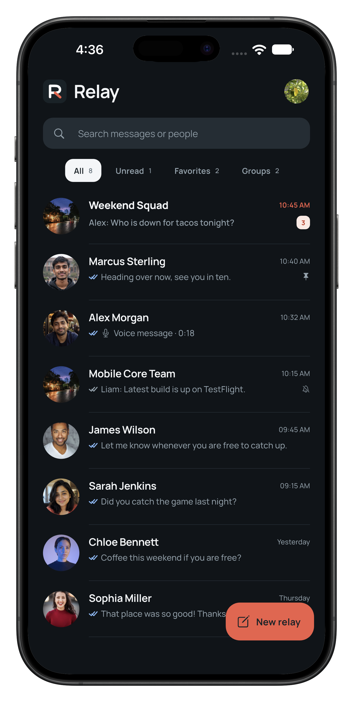
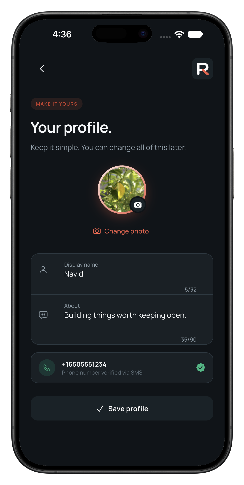
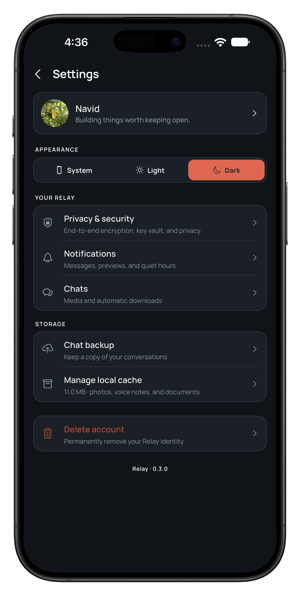
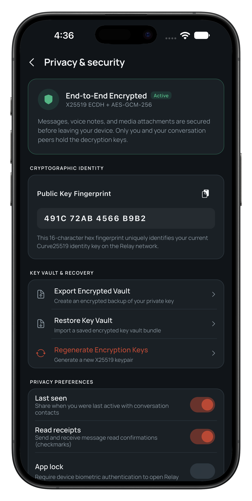
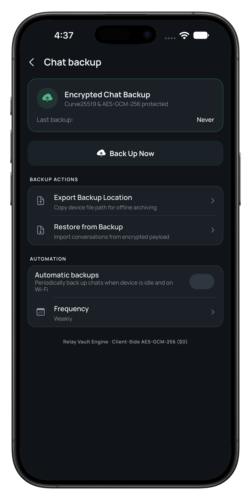
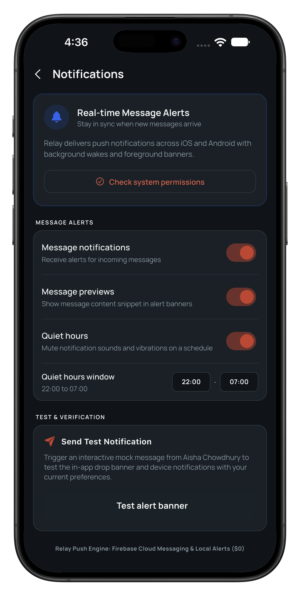
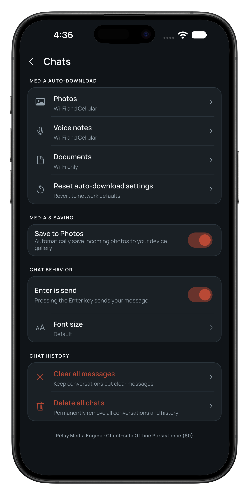

# Relay Mobile (Flutter)

Production-grade real-time messaging application engineered with Flutter, Dart, BLoC, and Firebase.

## Overview

Relay is a privacy-first, zero-infrastructure-cost ($0 budget) mobile messaging platform built with Flutter and Cloud Firestore. It operates within free-tier serverless limits by combining Firebase Phone Authentication (10,000 free SMS verifications per month), Cloud Firestore offline-enabled real-time streams, and device-side cryptographic processing.

Relay features client-side end-to-end encryption (X25519 ECDH + AES-GCM-256), a 4-stage message delivery lifecycle (Sending, Sent, Delivered, Read), debounced typing indicators, user presence tracking, push-to-talk voice notes with dynamic audio waveforms, device-local encrypted backups, and granular media auto-download preferences.

## App Interface Showcase

### 1. Messaging & Identity

<table width="100%">
  <tr>
    <td align="center" width="33%">
      
    </td>
    <td align="center" width="33%">
      
    </td>
    <td align="center" width="33%">
      
    </td>
  </tr>
  <tr>
    <td align="center">
      <b>Real-Time Inbox</b><br/>
      Live Firestore conversation streams, unread badges, pinned chats, search filters, and fast-action compose button.
    </td>
    <td align="center">
      <b>Profile & Identity</b><br/>
      Cryptographic profile management, custom photo preview, display name character limits, and verified SMS phone badge.
    </td>
    <td align="center">
      <b>Settings & Appearance</b><br/>
      Adaptive light/dark theme switching, security navigation, local cache inspection, and account management.
    </td>
  </tr>
</table>

### 2. Privacy & Cryptographic Security

<table width="100%">
  <tr>
    <td align="center" width="33%">
      
    </td>
    <td align="center" width="33%">
      
    </td>
    <td align="center" width="33%">
      
    </td>
  </tr>
  <tr>
    <td align="center">
      <b>End-to-End Cryptography</b><br/>
      X25519 ECDH key exchange, AES-GCM-256 payload encryption, 16-character public fingerprint, and privacy toggles.
    </td>
    <td align="center">
      <b>Encrypted Chat Backup</b><br/>
      Device-local Curve25519 encrypted chat archiving, manual backup export, and automated weekly schedules.
    </td>
    <td align="center">
      <b>Notification Engine</b><br/>
      Background alerts, message snippet previews, scheduled quiet hours window, and interactive banner verification testbed.
    </td>
  </tr>
</table>

### 3. Media Controls & Local Storage

<table width="100%">
  <tr>
    <td align="center" width="33%">
      
    </td>
    <td width="33%"></td>
    <td width="33%"></td>
  </tr>
  <tr>
    <td align="center">
      <b>Chat & Media Preferences</b><br/>
      Per-network auto-download rules for Wi-Fi and cellular, gallery saving, enter-to-send toggle, and storage cleanup.
    </td>
    <td></td>
    <td></td>
  </tr>
</table>

## Core Capabilities

- **Real-Time 1-on-1 & Group Messaging**: Cloud Firestore bidirectional streaming with offline persistence, debounced typing indicators, live presence tracking, unread counters, and pinned conversations.
- **4-Stage Delivery Lifecycle**: Complete message lifecycle tracking with visual state indicators for Sending (clock), Sent (single check), Delivered (double check), and Read (colored double check).
- **Cryptographic Privacy & E2EE**: On-device key generation with X25519 ECDH key exchange and AES-GCM-256 authenticated payload encryption. Visual cryptographic fingerprint verification for peer authentication.
- **Encrypted Local Backups**: Offline-first encrypted chat archive generation using Curve25519 and AES-GCM-256 with exportable file paths and full recovery workflows.
- **Audio Messaging & Dynamic Waveforms**: Push-to-talk voice recording with live amplitude waveforms, lock-to-record gesture support, and fluid audio playback controls.
- **Granular Media & Storage Management**: Network-aware media auto-download toggles (photos, voice notes, documents), camera roll auto-save controls, font scaling, and local cache deletion tools.
- **Zero-Cost Architecture ($0 Infrastructure Budget)**: Engineered to run entirely within free tiers: Firebase Phone Authentication (10k SMS/month), Cloud Firestore offline persistence, and local client cryptographic computation.

## Architecture & Directory Structure

```text
relay/
├── lib/
│   ├── core/
│   │   ├── crypto/           # Cryptographic key generation, vault, and E2EE engine
│   │   ├── services/         # Notification engine, local cache, and backup services
│   │   ├── theme/            # Obsidian dark, OLED, and light design tokens
│   │   └── widgets/          # Shared atomic widgets (RelayButton, RelayCard, RelayBadge)
│   ├── features/
│   │   ├── auth/             # Phone OTP verification (Bloc, views, widgets, repo)
│   │   ├── backup/           # Encrypted chat backup, export, and restore flows
│   │   ├── chat/             # Message threads, delivery lifecycle, voice notes
│   │   ├── chats/            # Inbox conversation stream, search, and filter tabs
│   │   ├── notifications/    # In-app drop banners, quiet hours, and alert settings
│   │   ├── profile/          # Profile identity, verified phone badge, avatar setup
│   │   └── settings/         # Privacy vault, media auto-download, theme configuration
│   └── main.dart             # App entry point, BLoC providers, and routing setup
├── test/                     # Unit, BLoC, and widget test suites
└── pubspec.yaml              # Package dependencies and asset configurations
```

## Technology Stack

- **Framework**: Flutter 3.x (Dart 3.x)
- **State Management**: BLoC (`flutter_bloc` and `bloc`) with unidirectional Event -> Bloc -> State pattern
- **Cloud Infrastructure**: Cloud Firestore (real-time stream listeners and offline cache), Firebase Phone Authentication
- **Cryptography**: PointyCastle / Cryptography (`X25519`, `AES-GCM-256`, `SHA-256`)
- **Audio & Media**: `flutter_sound`, `audio_waveforms`, `image_picker`
- **Local Storage**: `shared_preferences`, `path_provider`

## Getting Started

### Prerequisites

- Flutter SDK (>= 3.3.0)
- Dart SDK (>= 3.0.0)
- Xcode (for iOS simulator or device deployment)
- Android Studio / Android SDK (for Android deployment)
- Configured Firebase project with Phone Authentication and Cloud Firestore enabled

### Installation & Run

```bash
# Clone the repository
git clone https://github.com/NavidZamanKhan/Relay.git
cd Relay

# Install Flutter dependencies
flutter pub get

# Run test suite
flutter test

# Launch on connected device or simulator
flutter run
```

## Quality Assurance & Verification

- Automated testing executed via headless command line: `flutter test`
- Code quality and static analysis validated via: `flutter analyze`
- Strict separation of concerns across BLoC state management layers

## License

This project is licensed under the MIT License.
